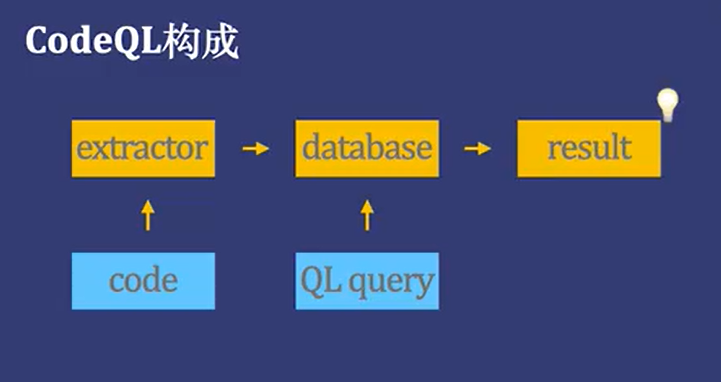
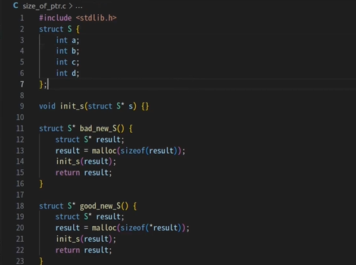
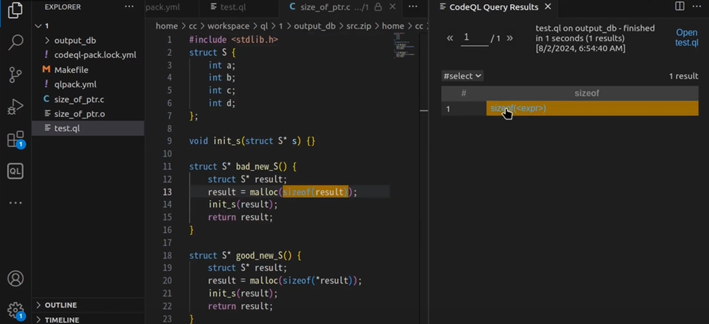

# 对VS Code扩展攻击与漏洞检测
---
**作者**：12112115王然 12111913李程 12211712张柬禾 12211209梁杰林

### 一、问题描述

作为世界上最受欢迎的集成开发环境之一，VS Code拥有超过4万个扩展。这些扩展为开发者提供了更为便利的开发环境，它们可以作为VS Code的子进程运行，并调用或扩展接口操作VS Code本身。随着针对软件供应链威胁的增加，集成开发环境（IDE）成为攻击者的目标之一。VS Code中有的扩展存在可被攻击的漏洞。本研究旨在研究通过VS Code扩展攻击的方式以及如何使用CodeQL扫描可能存在漏洞的扩展代码。

### 二、相关工作

2024年NDSS会议上的文章《UntrustIDE: Exploiting Weaknesses in VS Code Extensions》研究了如何用CodeQL筛选扩展代码中可能存在的漏洞，并提供了存在漏洞的扩展样例。

在论文中，研究人员基于 VS Code 扩展程序的威胁模型，构建了 12 个自定义的 CodeQL SAST 规则，用于检测潜在的代码注入和文件完整性漏洞。以下是部分例子：

**工作区设置**： 检测代码中是否从工作区设置中读取数据，并将其用于执行 shell 命令、评估 JavaScript 代码或写入文件。

**文件读取**： 检测代码中是否读取文件内容，并将其用于执行 shell 命令、评估 JavaScript 代码或写入文件。

**网络响应**： 检测代码中是否从网络响应中读取数据，并将其用于执行 shell 命令、评估 JavaScript 代码或写入文件。

### 三、预期结果

复现筛选与攻击实验，并开发一个带有实时监测扩展安全性功能的VS Code扩展。

### 四、工具使用

|工具名称|
|---|
|Visual Studio Code|
|Node.js|
|Git|
|CodeQL Yeoma|
|VSCode Extension generator|

#### 1.使用CodeQL 检测扩展中的漏洞
   
在CodeQL中，代码被视为数据。安全漏洞、bug 和其他错误建模为可针对从代码中提取的数据库执行的查询。可以运行编写好的标准 CodeQL 查询，也可以编写自己的查询以用于自定义分析。 查找潜在 bug 的查询会直接在源文件中突出显示结果。

CodeQL的构成主要分为两个部分，第一个部分是extractor,它会读取需要分析的代码，然后把代码转化为一个数据库，这个数据库里存放着代码的各种各样的细节，比如说每个类的函数，每个变量，每个表达式等等，可以说数据库等价与代码本身；第二个部分是QL语言，以此来查询我们感兴趣的代码模式。

第一步生成数据库的过程：以C代码在VS code上举例，生成数据库的过程和编译代码的过程是一样的，因为CodeQL会通过动态连接把代码注入到编译系统中，监视编译器比如说GCC和clang的调用，通过分析GCC和clang的命令行获得编译选项和源文件的路径，从而生成数据库(这一步用Makefile写)，可以在数据库目录的路径找到。

第二步QL查询：写好的Query可以直接用CodeQL命令行进行运行，在此次项目中我们会使用VS code提供的CodeQL插件来进行运行，在工程yml文件指定好的数据库。就可以正式开始写ql文件了，写好QL文件使用插件功能提供的“Run Query on Selected Database”就行了。

#### 2.实际实例的使用

在size_of_ptr.c文件这种中，我们声明了两个struct: 一个是bad_new_S(),另一个good_new_S()。可以发现在使用malloc()函数申请result的内存大小时bad_new_S()是直接使用了result指针，而不是*result,在64位操作系统中指针是8个字节而不是result的实际大小，如果不加以保护的话代码就有可能出现内存泄漏的问题，接下来我们就是用Code QL进行查询。

检测结果：

### 五、项目计划

**前期工作**：研读论文，了解CodeQL，包括如何使用，如何编写QL语句。使用CodeQL进行简单的漏洞查询。对论文中提出的CodeQL规则进行学习和分析。

**中期工作**：利用VScode和Node.js编写几个带有漏洞的插件，并利用CodeQL对带有漏洞代码的插件进行检测，复现恶意程序对扩展的攻击过程以及检测出漏洞的过程。

**后期工作**：计划开发一个带有实时检测漏洞功能的VScode扩展，安装该扩展后可以实时扫描检测出带有上述漏洞类型的插件，并给予用户警告。

### 六、项目分工

| 任务|人员 |
|---|---|
|应用CodeQL筛选漏洞代码|**王然**|
|VS Code扩展编写|**李程**|
|VS Code扩展漏洞分析|**梁杰林**|
|VS Code扩展漏洞攻击|**张柬禾**|